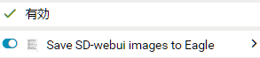
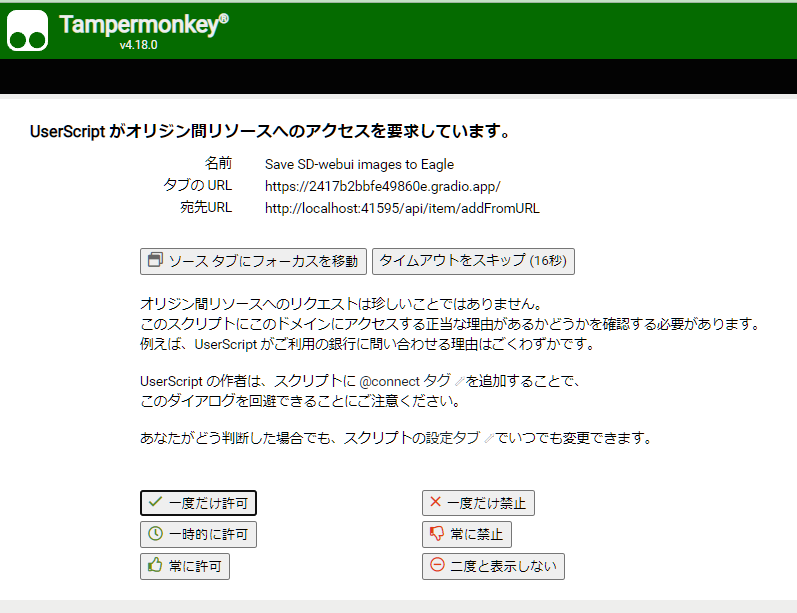

# sdweb-eagle-pnginfo for Tampermonkey

- Add right-click menu on web-browser for [WebUI by AUTOMATIC1111](https://github.com/AUTOMATIC1111/stable-diffusion-webui) 
  
   - By "Send to Eagle" command, send images listed on webui to local [Eagle](https://jp.eagle.cool/) app.

- user script of [Tampermonkey](https://www.tampermonkey.net/)
  
   - so, requirey  [Tampermonkey](https://www.tampermonkey.net/) on web-browser
   - Tampermonkey is "User script manager Extension for Chrome(or other browser)"

## Features

- Send image which you generate on WebUI to local [Eagle](https://jp.eagle.cool/) App
   - Register `tag` and `generation info` as metadata

### Note

- If you are running webui on local, I recommend to use [bbc-mc/sdweb-eagle-pnginfo](https://github.com/bbc-mc/sdweb-eagle-pnginfo) Extension

- this userscript is workaround for cloud users.

## How to install

- Install tampermonkey

- Install this script ".user.js"
  
   - Go to dashboard and open script by pushing "Edit"
  
   - Change `@match` setting with your gradio.app URL
     
      - default
          ```// @match        https://localhost:7650/*```
     
      - if your web app is opened at `12345.gradio.app`, change this URL to
          ```// @match        https://12345.gradio.app/*```
     
      - FYI: you can change this as ALWAYS WORK on gradio.app (I know this convenient, but I do NOT RECOMMEND.).
        
        `// @match        https://*.gradio.app/*`

- Reload your webapp page of browser (to enable this script change)

- Make sure this script is enabled on Webui address
  
  

## How to use

### Send image

- (Generate images on Web UI)

- (Wait until generation finished and images complitely shown in gallery)

- Right click on Web UI
  
   - Select menu "Tampermonkey"
     
      - Select sub-menu "Save SD-webui images to Eagle"
        
        

- Assertion about "CORS" access from Tampermonkey shown as below.
  
   - push "allow" or "allow temporary" or "allow once" to proceed
     

## Known bug/issues

- Filename on Eagle is mess...
- Sometimes "tag" or "Generation info" is not correctly registered to Eagle.
